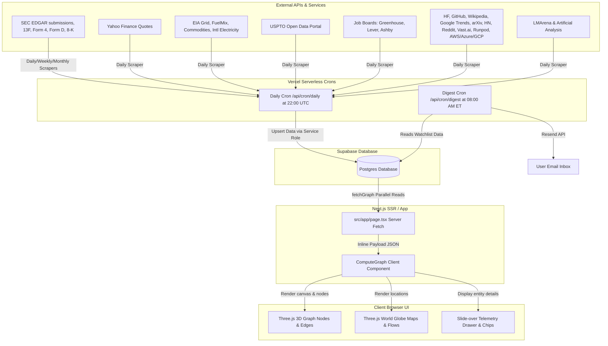

# Compute Circuit — System Architecture

Compute Circuit is a high-density, real-time intelligence dashboard tracking the global artificial intelligence compute supply chain. This document maps out the system's data pipelines, database schema, ingestion crons, rate limits, and design system.

---

## 1. System Data Flow

The architecture operates on an **overnight batch-ingestion model** that feeds a **highly-optimized single-request SSR page**. 

1. **Ingestion (Overnight)**: Vercel Cron triggers the master dispatcher (`/api/cron/daily`) at 22:00 UTC, which sequentially invokes 17 distinct sub-crons to fetch from downstream APIs and databases.
2. **Storage**: Data is processed and upserted into **Supabase Postgres** using the `service_role` key (bypassing RLS rules).
3. **Delivery (SSR)**: When a user requests the app, Next.js server-fetches (`src/app/page.tsx`) the entire graph taxonomy and 35-day historical telemetry in a single parallel query (`fetchGraph()`), streaming the serialized JSON directly into the client page.
4. **Presentation**: The browser renders the nodes and layers using **Three.js** (3D Graph & World Globe views) and displays detailed telemetry charts and news signals in the slide-over metadata drawer.
5. **Digest (Morning)**: A dedicated cron job at 12:00 UTC (8:00 AM ET) compiles the watchlist signals and emails a daily brief using the **Resend API**.



---

## 2. Core Database Schema & Row Counts

The database is designed with two structural layers: **Core Taxonomy** (relational tables mapping the supply chain network) and **Telemetry Snapshots** (timeseries tables tracking daily updates).

### Core Taxonomy Tables
These tables hold the graph topology (nodes, layers, edges).

| Table Name | Primary Key | Foreign Keys / Relations | Description | Seed Row Count |
| :--- | :--- | :--- | :--- | :--- |
| `layers` | `id` (text) | None | The 16 vertical stack layers (e.g. `oil-gas`, `foundry`, `chips`, `labs`, `government`). | 16 rows |
| `companies` | `id` (text) | `layer_id` → `layers.id` | Core companies tracked. Includes metadata (ticker, domain, coordinates, logo). | ~185 rows |
| `investors` | `id` (text) | None | VC funds & institutional backers (e.g., `a16z`, `sequoia`, `blackrock`). | 12 rows |
| `company_backers`| `(company_id, investor_id)` | Joint to `companies`, `investors` | Map of venture backing and cap table relationships. | ~25 rows |
| `flows` | `id` (uuid) | Polymorphic node IDs | Directed edges representing supply, investment, energy, or hardware movement. | ~100 rows |
| `bottlenecks` | `id` (text) | `layer_id` → `layers.id` | Supply chain bottlenecks (e.g., `cowos` packaging, `hbm-supply`). | 5 rows |
| `bottleneck_beneficiaries` | `(bottleneck_id, company_id)` | Joint to `bottlenecks`, `companies` | Identifies companies that benefit financially from a bottleneck. | ~15 rows |
| `agencies` | `id` (text) | `layer_id` → `layers.id` | Regulators & export-control bodies (e.g. US BIS, EU AI Office). | 22 rows |

### Telemetry & Signal Tables
These tables capture timeseries events and daily telemetry. Row counts scale daily as crons run.

| Table Name | Primary Key | Join Keys | Description | Populated By |
| :--- | :--- | :--- | :--- | :--- |
| `signals` | `id` (uuid) | Joined via joint tables | Overnight events (news, 8-K filings, regulatory notices). | Google News & SEC EDGAR |
| `signal_companies` | `(signal_id, company_id)` | Joint table | Links news/filings to the relevant companies. | Ingestion Crons |
| `signal_bottlenecks` | `(signal_id, bottleneck_id)` | Joint table | Links news/filings to the relevant bottlenecks. | Ingestion Crons |
| `holdings` | `id` (uuid) | `investor_id`, `company_id` | 13F holding records matching our companies. | SEC EDGAR 13F Tracker |
| `fundamentals` | `id` (uuid) | `company_id` | Key quarterly financials (Revenue, Capex, Gross Profit). | SEC EDGAR CompanyFacts |
| `insider_transactions` | `id` (uuid) | `company_id` | Form 4 insider stock purchases and sales. | SEC EDGAR Form 4 Poller |
| `funding_rounds` | `id` (uuid) | `company_id` | Form D filing details for private companies. | SEC EDGAR Form D Poller |
| `transcript_signals` | `id` (uuid) | `company_id` | NLP counts (AI, GPU, Capex mentions) in earnings 8-Ks. | SEC EDGAR & YouTube |
| `gpu_spot_prices` | `id` (uuid) | None | Hourly/daily rental spot rates for major GPUs. | Vast.ai & Runpod APIs |
| `gpu_hyperscaler_pricing`| `id` (uuid) | None | Spot and on-demand GPU prices for AWS/Azure/GCP. | Cloud Provider APIs |
| `hf_activity` | `id` (uuid) | `company_id` | Monthly downloads and model counts on Hugging Face. | Hugging Face API |
| `github_activity` | `id` (uuid) | `company_id` | Repo statistics (commits, stars, contributors, lines). | GitHub API |
| `grid_demand_snapshots` | `id` (uuid) | `company_id` | Region-level data center electricity draw. | EIA Grid API |
| `patent_snapshots` | `id` (uuid) | `company_id` | USPTO patent filings TTM counts and category codes. | USPTO ODP Search API |
| `job_snapshots` | `id` (uuid) | `company_id` | Active hiring postings counts and ATS categories. | Greenhouse, Lever, Ashby |
| `eia_commodity_snapshots`| `id` (uuid) | None | Energy feedstock commodities (Henry Hub gas, coal). | EIA Open Data API |
| `eia_fuelmix_snapshots` | `id` (uuid) | None | Generation fuel mix and carbon intensity metrics. | EIA Grid API |
| `eia_international_snapshots`| `id` (uuid) | None | Country electricity production for key fab nations. | EIA International API |
| `aeo_projections` | `id` (uuid) | None | Long-term data center electrical demand forecasts. | EIA Annual Energy Outlook |
| `social_mentions` | `id` (uuid) | `company_id` | HN and Reddit mention velocity counts. | HN Search & Reddit API |
| `interest_signals` | `id` (uuid) | `company_id` | Wikipedia traffic and Google Trends search index. | Wikipedia & Google Trends |
| `arxiv_papers` | `id` (uuid) | `company_id` | Metadata for arXiv papers authored by company labs. | arXiv API |
| `arxiv_snapshots` | `id` (uuid) | `company_id` | Count of papers published over 7-day and 30-day windows.| arXiv API |
| `verifications` | `id` (uuid) | None | Audits of claims with verdicts and confidence scores. | Manual Analyst Input |

---

## 3. Data Ingestion & Ingestion Crons

All crons are written as Next.js Route Handlers. They require a `Bearer CRON_SECRET` authorization header.

### Ingestion Schedules & Rates

```
Vercel Daily Dispatcher (/api/cron/daily) — Nightly at 22:00 UTC
│
├── prices               (Daily, Yahoo Finance Chart, ~32 HTTP calls)
├── 8k-tracker           (Daily, SEC EDGAR RSS, ~32 calls)
├── transcripts          (Daily, SEC EDGAR Exhibit 99.1 & YouTube Transcripts, ~30 calls)
├── news                 (Daily, Google News RSS, Parallel chunks of 12)
├── insider              (Daily, SEC EDGAR Form 4 XML, Capped at 120 calls)
├── form-d               (Daily, SEC EDGAR Form D XML, ~10 calls)
├── hf-activity          (Daily, Hugging Face API, ~20 calls)
├── github               (Daily, GitHub API, ~40 calls, authenticated)
├── eia                  (Daily, EIA API v2, ~20 calls, authenticated)
├── patents              (Daily, USPTO ODP Search, ~21 calls, authenticated)
├── jobs                 (Daily, Greenhouse/Lever/Ashby ATS APIs, ~20 calls)
├── btc                  (Daily, Blockchain Info / Blockchair APIs, ~3 calls)
├── gpu-spot             (Daily, Vast.ai & Runpod APIs, ~5 calls)
├── leaderboard          (Daily, LMArena & AA public endpoints, ~2 calls)
├── social               (Daily, Algolia HN Search & Reddit API, ~60 calls)
├── interest             (Daily, Wikipedia Pageviews & Google Trends, ~100 calls)
├── arxiv                (Daily, arXiv API, ~30 calls)
├── logo-maintenance     (Daily, Wikipedia & Clearbit, Capped at 30 companies)
│
├── [Tuesdays only] fundamentals (Weekly, SEC EDGAR CompanyFacts, ~32 calls)
├── [Sundays only]  13f-tracker  (Weekly, SEC EDGAR 13F-HR XML, ~12 calls)
└── [1st of Month]  portfolio-scraper (Monthly, SEC EDGAR Form D FTS, ~12 calls)
```

### Politeness & Rate-Limiting Protocols

To prevent IP bans and respect upstream API providers, the scrapers implement strict rate-limiting protocols:

1. **SEC EDGAR**:
   - The SEC enforces a hard rate limit of **10 requests per second** across all endpoints.
   - The Compute Circuit client (`src/lib/edgar.ts`) uses a custom sequential runner with a **150ms sleep** between calls (limiting throughput to ~6.6 req/sec).
   - In accordance with SEC policy, all requests set a customized `User-Agent` header containing the system's contact email. Requests with plain generic user agents are rejected with `403 Forbidden`.
2. **USPTO Open Data Portal**:
   - The patent scraper (`src/lib/uspto.ts`) enforces a **200ms sleep** between sequential company assignee queries to prevent rate limiting.
3. **Logo Maintenance Favicon Crawler**:
   - Scraping Wikipedia and crawling company websites for favicons is computationally heavy and risks rate-limiting.
   - The logo resolver (`src/app/api/cron/logo-maintenance`) filters for companies with incomplete or stale logo records and caps execution at **30 companies per invocation**.
4. **GitHub & EIA APIs**:
   - Ingestion requires personal developer tokens (`GITHUB_TOKEN` and `EIA_API_KEY`) to bypass public rate limits and authenticate successfully.

---

## 4. Phase 6 Design System

The application's visual layout is styled using **Phase 6 design tokens**. The core aesthetic guidelines require a dark HUD dashboard ("Stripe Atlas running on a Bloomberg terminal").

### 1. Color Palette Tokens

Color tokens are defined in `tailwind.config.ts` and mirrored in `src/lib/design-tokens.ts` (using hex strings) for Canvas/SVG/Three.js rendering:

```typescript
export const TOKENS = {
  bg: {
    canvas:  '#0A0B0F', // Main screen backdrop
    surface: '#13151C', // Card panels, dialogs, sidebar drawers
    hover:   '#1B1E26', // Hovered list items and button states
    overlay: '#0F1117CC'// 80% opacity for dropdown overlays
  },
  border: {
    default: '#262A33', // Default panel and node hairlines
    subtle:  '#1B1E26', // Inner divider lines
    strong:  '#3A3F4B', // Focus rings, active button borders
  },
  fg: {
    primary:   '#F2F3F5', // High-contrast headers and values
    secondary: '#A5A8B0', // Body copy and labels
    muted:     '#6B6F7A', // Help text and metadata
    dim:       '#43474F', // Inactive selectors and placeholders
  },
  signal: {
    healthy: '#34D399', // Emerald-400 (Up price, active systems, resolved bottlenecks)
    warn:    '#FBBF24', // Amber-400 (Warning, flat metrics, resolving bottlenecks)
    alert:   '#F87171', // Red-400 (Down price, critical bottlenecks, system outages)
    info:    '#22D3EE', // Cyan-400 (Informational updates, newly discovered entities)
  },
  accent: {
    primary:     '#A78BFA', // Brand purple (Venture Capital / Investment flows)
    secondary:   '#F472B6', // Brand pink (Hiring / Jobs signal)
    gradStart:   '#A78BFA', // Purple gradient start
    gradEnd:     '#22D3EE', // Cyan gradient end
  },
  feed: {
    price:    '#34D399', // Stock quotes
    news:     '#22D3EE', // Google News RSS feed
    filings:  '#FB923C', // Orange (SEC filings, Form D, 8-K)
    insider:  '#F87171', // Red (Insider Form 4 transactions)
    holdings: '#34D399', // Emerald (13F institutional holdings)
    hf:       '#FCD34D', // Gold (Hugging Face model counts)
    github:   '#E879F9', // Fuchsia-400 (GitHub code commits / dev velocity)
    grid:     '#FACC15', // Yellow (Electricity grid power demand)
    patents:  '#A78BFA', // Purple (Patent applications)
    jobs:     '#F472B6', // Pink (ATS hiring reqs count)
  }
} as const;
```

### 2. Typography Scale

The font scale prioritizes data density and readability. Elements use Google Font's **Outfit** for headlines and **Inter** for charts and body copy:

- **Headline** (`text-headline`): `2.0rem` / `line-height: 2.25rem` (Semibold/Bold, tracking `-0.02em`)
- **Stat Large** (`text-stat-lg`): `1.75rem` / `line-height: 2.0rem` (Semibold, tracking `-0.01em`)
- **Stat Normal** (`text-stat`): `1.25rem` / `line-height: 1.5rem` (Semibold, tracking `-0.005em`)
- **Title** (`text-title`): `0.9375rem` / `line-height: 1.375rem` (Semibold)
- **Body** (`text-body`): `0.8125rem` / `line-height: 1.25rem` (Regular)
- **Label** (`text-label`): `0.6875rem` / `line-height: 1.0rem` (Semibold, tracking `0.075em` uppercase)
- **Meta** (`text-meta`): `0.625rem` / `line-height: 0.875rem` (Regular)

### 3. Shadows & Radii

HUD dashboard items appear floating above the canvas using specific shadows:

- **Panel Shadow** (`shadow-panel`): `0 8px 24px -4px rgba(0,0,0,.45), 0 0 0 1px rgba(255,255,255,.04)`
- **Card Shadow Large** (`shadow-card-lg`): `0 4px 12px -2px rgba(0,0,0,.35), 0 2px 4px -2px rgba(0,0,0,.20)`
- **Card Shadow** (`shadow-card`): `0 1px 2px 0 rgba(0,0,0,.20), 0 1px 1px 0 rgba(0,0,0,.06)`
- **Rounded Corners** (`rounded-card`): `0.875rem` (14px) for cards and modals.

---

## 5. Guidelines for Contributors

When developing new features or modifying the data ingestion pipeline, developers must adhere to these structural policies:

1. **Do Not Hardcode Colors**: Use the Tailwind utility classes (e.g. `bg-bg-surface`, `border-border-default`) for all UI styling. For Canvas/WebGL components, import `TOKENS` from `@/lib/design-tokens` and translate hex values using the `hexToNum` helper.
2. **Schema Migrations**: Database changes must be written as sequential, idempotent SQL files under `supabase/migrations/` (e.g. `0043_feature_name.sql`). Always use `CREATE TABLE IF NOT EXISTS`, `ALTER TABLE ... ADD COLUMN IF NOT EXISTS`, and `CREATE INDEX IF NOT EXISTS`.
3. **Idempotent Seeding**: Any new core taxonomies (layers, companies, investors) should be added to `supabase/seed/data.ts`. The seed script (`npm run seed`) is designed to run multiple times safely via `upsert` constraints. Do not wipe transaction histories during seeds.
4. **Strict Rate Pacing**: Any new cron jobs that pull external API data must implement sequential fetching with sleep delays. Running parallel batch queries against public APIs without sleep is prohibited.
