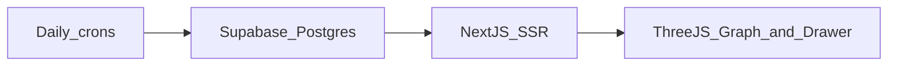

# Offtake

**The ledger of disclosed AI compute contracts.** Every colocation lease, GPU cloud capacity agreement, hosting deal, power supply contract and equipment purchase that a public company has disclosed, read from the SEC filing it appeared in, one row per disclosure, with the verbatim excerpt the figures came from. Free data sources, open source.

Live: https://offtakeledger.vercel.app/contracts · CSV: `/api/contracts/export`

Underneath it: the Compute Circuit research backbone — the AI-compute supply-chain graph and 25 free daily data feeds.

---

## Architecture



---

**Live demo:** https://offtakeledger.vercel.app

---

## Screenshots

{{TODO: insert screenshot of graph view}}

{{TODO: insert screenshot of globe view}}

{{TODO: insert screenshot of drawer}}

{{TODO: insert screenshot of mobile bottom‑nav}}

{{TODO: insert screenshot of supply‑chain strip}}

---

## What it tracks

- 25+ daily data sources (each cron + drawer chip listed in the repo)
- Company fundamentals, market prices, insider transactions, patents, AI‑generated theses, and more.

---

## Why open source?

Data should be free for everyone researching the AI build‑out. By open‑sourcing the dashboard and its pipelines we empower the community to explore, remix, and extend the ecosystem without barriers.

---

## Tech stack

- **Frontend:** Next.js 14 (SSR) + Three.js for the interactive graph
- **Styling:** Tailwind CSS with Phase 6 design tokens
- **Backend:** Supabase Postgres (hosted) + Vercel serverless functions for daily crons
- **Deploy:** Vercel (static + serverless) + Supabase free tier

---

## Quick start (local development)

```bash
pnpm install && cp .env.example .env.local && pnpm dev
```

---

## Further docs

- [DEPLOYMENT.md](DEPLOYMENT.md)
- [CONTRIBUTING.md](CONTRIBUTING.md)
- [ARCHITECTURE.md](ARCHITECTURE.md)

---

*All code is licensed under AGPL‑3.0 (see LICENSE).*
